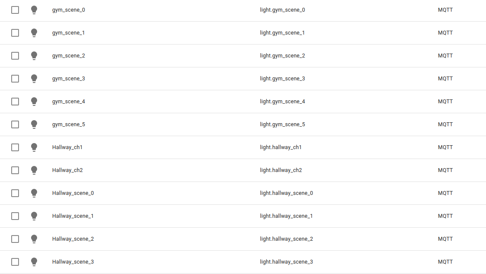

# Rako_Adapter_MQTT

Created on Linux using CodeLite IDE and Qmake based.

#For the RAKO HUB Lighting controller to HomeAssistant MQTT interface 

This is a work in progress..... your mileage may vary... it was written in a day as a test.. it worked awesomely.
Error checking is minimal - it was quick! 

 
Working  
  * Config Discovery pushing to HomeAssistant 
  * Individual lights controllable (16 Channels)  
  * 5 SCENE switches... SCENE 0 should be set to OFF 
  * Events from RAKO (Scene and lightint values)  
  
  
Rooms are to be configured from 1 to 32 (If you want more, then change the values) - Scenes are set in the RAKO unit

rako_adapter -r [RAKO ip address] -m [MQTT IP] -u [MQTT Username] -p [MQTT Password]

Product_Type:           Hub 
Product_HubId:          12345cad-254f-0000-beef-4d63deadbeef 
Product_MAC:            70:B3:D5:--:--:-- 
Product_Version:        3.1.6 

Room 0 [LIGHT] House Master 
 
Room 1 [LIGHT] Hallway 
	Channel 1	Channel 1 
	Channel 2	test 
 
Room 2 [LIGHT] downstairs bathroom 
	Channel 1	Channel 1 
 
Room 3 [LIGHT] plant room 
	Channel 1	Channel 1 
 
Room 5 [LIGHT] dining 
	Channel 2	Dining room pendants 
	Channel 3	dining downlights 
	

